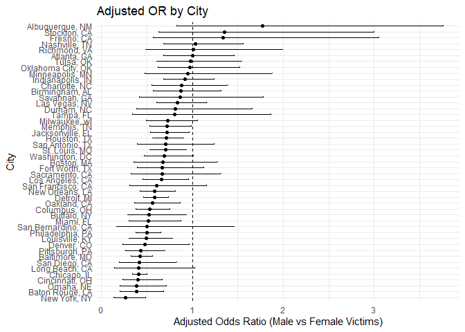

p8105_hw6_yx3033
================

``` r
library(tidyverse)
```

## Problem 1

``` r
homi_raw = read_csv("hw6_data/homicide-data.csv")
```

    ## Rows: 52179 Columns: 12
    ## ── Column specification ────────────────────────────────────────────────────────
    ## Delimiter: ","
    ## chr (9): uid, victim_last, victim_first, victim_race, victim_age, victim_sex...
    ## dbl (3): reported_date, lat, lon
    ## 
    ## ℹ Use `spec()` to retrieve the full column specification for this data.
    ## ℹ Specify the column types or set `show_col_types = FALSE` to quiet this message.

``` r
homicide_df =
  homi_raw |>
  mutate(
    city_state = paste(city, state, sep = ", "),
    #solved = 1
    solve_binary = if_else(disposition == "Closed by arrest", 1, 0)
  ) |>
  filter(
    !city_state %in% c("Dallas, TX", "Phoenix, AZ", 
                       "Kansas City, MO", "Tulsa, AL")
  ) |>
  filter(
    victim_race %in% c("White", "Black")  
  ) |>
  mutate(
    victim_age = as.numeric(victim_age)
  )
```

    ## Warning: There was 1 warning in `mutate()`.
    ## ℹ In argument: `victim_age = as.numeric(victim_age)`.
    ## Caused by warning:
    ## ! NAs introduced by coercion

``` r
baltimore_df = 
  homicide_df |> 
  filter(city_state == "Baltimore, MD")

glm_md = glm(
  solve_binary ~ victim_age + victim_sex + victim_race,
  data = baltimore_df,
  family = binomial()
)

glm_md_tidy =
  glm_md |> 
  broom::tidy(conf.int = TRUE, exponentiate = TRUE)

male_or =
  glm_md_tidy |> 
  filter(term == "victim_sexMale") |> 
  select(term, estimate, conf.low, conf.high)

male_or
```

    ## # A tibble: 1 × 4
    ##   term           estimate conf.low conf.high
    ##   <chr>             <dbl>    <dbl>     <dbl>
    ## 1 victim_sexMale    0.426    0.324     0.558

After adjusting for victim age and race, homicides involving male
victims had significantly lower odds of being solved compared to those
involving female victims (adjusted OR = 0.426, 95% CI: 0.324–0.558).

``` r
library(dplyr)
library(tidyr)
library(purrr)
library(broom)
```

``` r
city_results =
  homicide_df |> 
  group_by(city_state) |> 
  nest() |> 
  mutate(
    # fit glm for each city
    model = map(data, ~ glm(
      solve_binary ~ victim_age + victim_sex + victim_race,
      data = .x,
      family = binomial()
    )),
    
    # tidy model results with OR and CI
    tidied = map(model, ~ tidy(
      .x,
      conf.int = TRUE,
      exponentiate = TRUE
    ))
  ) |>
  unnest(tidied) |> 
  filter(term == "victim_sexMale") |> 
  select(
    city_state,
    estimate,
    conf.low,
    conf.high
  )
```

    ## Warning: There were 43 warnings in `mutate()`.
    ## The first warning was:
    ## ℹ In argument: `tidied = map(model, ~tidy(.x, conf.int = TRUE, exponentiate =
    ##   TRUE))`.
    ## ℹ In group 1: `city_state = "Albuquerque, NM"`.
    ## Caused by warning:
    ## ! glm.fit: fitted probabilities numerically 0 or 1 occurred
    ## ℹ Run `dplyr::last_dplyr_warnings()` to see the 42 remaining warnings.

``` r
library(ggplot2)
```

``` r
city_results_plot =
  ggplot(city_results, 
       aes(x = estimate, y = reorder(city_state, estimate))) +
  geom_point() +
  geom_errorbarh(aes(xmin = conf.low, xmax = conf.high), height = 0.2) +
  geom_vline(xintercept = 1, linetype = "dashed") +
  labs(
    x = "Adjusted Odds Ratio (Male vs Female Victims)",
    y = "City",
    title = "Adjusted OR by City"
  ) +
  theme_minimal()

city_results_plot
```

<!-- -->

## Problem 2

``` r
library(p8105.datasets)
data("weather_df")
```

``` r
bootstrap_estimate = function(data) {
  
  boot_sample = sample_frac(data, replace = TRUE)

  fit = lm(tmax ~ tmin + prcp, data = boot_sample)

  r2_val = glance(fit)$r.squared

  coefs = tidy(fit)
  beta_tmin = coefs$estimate[coefs$term == "tmin"]
  beta_prcp = coefs$estimate[coefs$term == "prcp"]
  
  ratio = beta_tmin / beta_prcp
  
  tibble(
    r2 = r2_val,
    beta_ratio = ratio
  )
}
```

``` r
set.seed(123) 

boot_results =
  replicate(
    n = 5000,
    expr = bootstrap_estimate(weather_df),
    simplify = FALSE
  ) |> 
  bind_rows()
```
