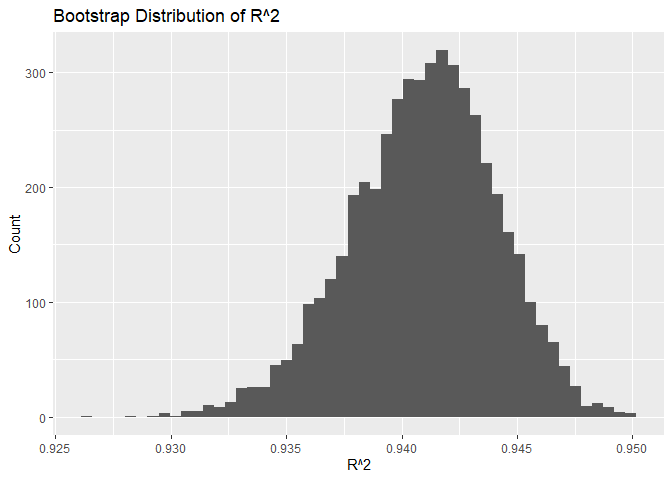
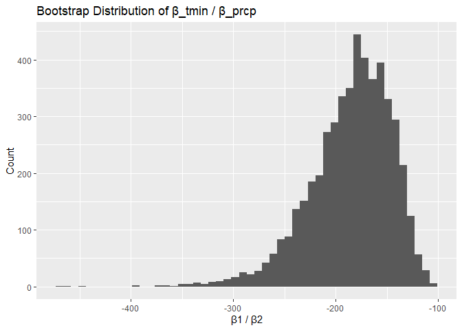
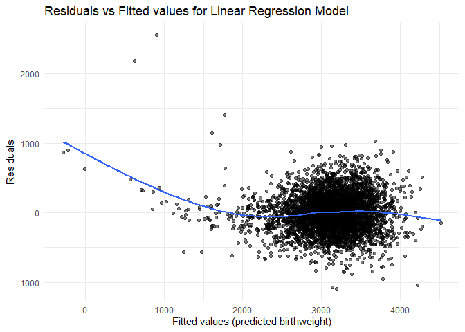
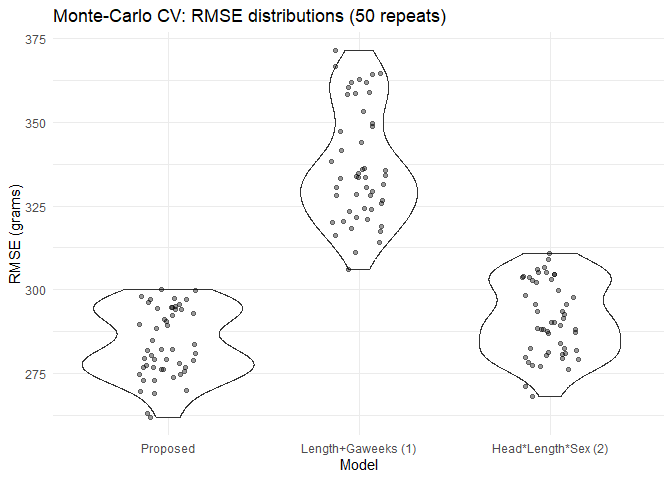

p8105_hw6_yx3033
================

``` r
library(tidyverse)
```

## Problem 1

``` r
homi_raw = read_csv("hw6_data/homicide-data.csv")
```

    ## Rows: 52179 Columns: 12
    ## ── Column specification ────────────────────────────────────────────────────────
    ## Delimiter: ","
    ## chr (9): uid, victim_last, victim_first, victim_race, victim_age, victim_sex...
    ## dbl (3): reported_date, lat, lon
    ## 
    ## ℹ Use `spec()` to retrieve the full column specification for this data.
    ## ℹ Specify the column types or set `show_col_types = FALSE` to quiet this message.

``` r
homicide_df =
  homi_raw |>
  mutate(
    city_state = paste(city, state, sep = ", "),
    #solved = 1
    solve_binary = if_else(disposition == "Closed by arrest", 1, 0)
  ) |>
  filter(
    !city_state %in% c("Dallas, TX", "Phoenix, AZ", 
                       "Kansas City, MO", "Tulsa, AL")
  ) |>
  filter(
    victim_race %in% c("White", "Black")  
  ) |>
  mutate(
    victim_age = as.numeric(victim_age)
  )
```

    ## Warning: There was 1 warning in `mutate()`.
    ## ℹ In argument: `victim_age = as.numeric(victim_age)`.
    ## Caused by warning:
    ## ! NAs introduced by coercion

``` r
baltimore_df = 
  homicide_df |> 
  filter(city_state == "Baltimore, MD")

glm_md = glm(
  solve_binary ~ victim_age + victim_sex + victim_race,
  data = baltimore_df,
  family = binomial()
)

glm_md_tidy =
  glm_md |> 
  broom::tidy(conf.int = TRUE, exponentiate = TRUE)

male_or =
  glm_md_tidy |> 
  filter(term == "victim_sexMale") |> 
  select(term, estimate, conf.low, conf.high)

male_or
```

    ## # A tibble: 1 × 4
    ##   term           estimate conf.low conf.high
    ##   <chr>             <dbl>    <dbl>     <dbl>
    ## 1 victim_sexMale    0.426    0.324     0.558

After adjusting for victim age and race, homicides involving male
victims had significantly lower odds of being solved compared to those
involving female victims (adjusted OR = 0.426, 95% CI: 0.324–0.558).

``` r
library(dplyr)
library(tidyr)
library(purrr)
library(broom)
```

``` r
city_results =
  homicide_df |> 
  group_by(city_state) |> 
  nest() |> 
  mutate(
    # fit glm for each city
    model = map(data, ~ glm(
      solve_binary ~ victim_age + victim_sex + victim_race,
      data = .x,
      family = binomial()
    )),
    
    # tidy model results with OR and CI
    tidied = map(model, ~ tidy(
      .x,
      conf.int = TRUE,
      exponentiate = TRUE
    ))
  ) |>
  unnest(tidied) |> 
  filter(term == "victim_sexMale") |> 
  select(
    city_state,
    estimate,
    conf.low,
    conf.high
  )
```

    ## Warning: There were 43 warnings in `mutate()`.
    ## The first warning was:
    ## ℹ In argument: `tidied = map(model, ~tidy(.x, conf.int = TRUE, exponentiate =
    ##   TRUE))`.
    ## ℹ In group 1: `city_state = "Albuquerque, NM"`.
    ## Caused by warning:
    ## ! glm.fit: fitted probabilities numerically 0 or 1 occurred
    ## ℹ Run `dplyr::last_dplyr_warnings()` to see the 42 remaining warnings.

``` r
library(ggplot2)
```

``` r
city_results_plot =
  ggplot(city_results, 
       aes(x = estimate, y = reorder(city_state, estimate))) +
  geom_point() +
  geom_errorbarh(aes(xmin = conf.low, xmax = conf.high), height = 0.2) +
  geom_vline(xintercept = 1, linetype = "dashed") +
  labs(
    x = "Adjusted Odds Ratio (Male vs Female Victims)",
    y = "City",
    title = "Adjusted OR by City"
  ) +
  theme_minimal()

city_results_plot
```

<!-- -->

## Problem 2

``` r
library(p8105.datasets)
data("weather_df")
```

``` r
bootstrap_estimate = function(data) {
  
  boot_sample = sample_frac(data, replace = TRUE)

  fit = lm(tmax ~ tmin + prcp, data = boot_sample)

  r2_val = glance(fit)$r.squared

  coefs = tidy(fit)
  beta_tmin = coefs$estimate[coefs$term == "tmin"]
  beta_prcp = coefs$estimate[coefs$term == "prcp"]
  
  ratio = beta_tmin / beta_prcp
  
  tibble(
    r2 = r2_val,
    beta_ratio = ratio
  )
}
```

``` r
set.seed(123) 

boot_results =
  replicate(
    n = 5000,
    expr = bootstrap_estimate(weather_df),
    simplify = FALSE
  ) |> 
  bind_rows()
```

plot distributions

``` r
boot_results |> 
  ggplot(aes(x = r2)) +
  geom_histogram(bins = 50) +
  labs(
    title = "Bootstrap Distribution of R^2",
    x = "R^2",
    y = "Count"
  )
```

<!-- -->

``` r
boot_results |> 
  ggplot(aes(x = beta_ratio)) +
  geom_histogram(bins = 50) +
  labs(
    title = "Bootstrap Distribution of β_tmin / β_prcp",
    x = "β1 / β2",
    y = "Count"
  )
```

<!-- -->

compute the CIs

``` r
boot_results |> 
  summarize(
    lower = quantile(r2, 0.025),
    upper = quantile(r2, 0.975)
  )
```

    ## # A tibble: 1 × 2
    ##   lower upper
    ##   <dbl> <dbl>
    ## 1 0.934 0.947

``` r
boot_results |> 
  summarize(
    lower = quantile(beta_ratio, 0.025),
    upper = quantile(beta_ratio, 0.975)
  )
```

    ## # A tibble: 1 × 2
    ##   lower upper
    ##   <dbl> <dbl>
    ## 1 -279. -125.

## Problem 3

``` r
library(tidyverse)
library(modelr)
library(purrr)
library(broom)
library(ggplot2)
```

``` r
bth_weight = read_csv("hw6_data/birthweight.csv")
```

    ## Rows: 4342 Columns: 20
    ## ── Column specification ────────────────────────────────────────────────────────
    ## Delimiter: ","
    ## dbl (20): babysex, bhead, blength, bwt, delwt, fincome, frace, gaweeks, malf...
    ## 
    ## ℹ Use `spec()` to retrieve the full column specification for this data.
    ## ℹ Specify the column types or set `show_col_types = FALSE` to quiet this message.

check nas

``` r
sum(is.na(bth_weight))
```

    ## [1] 0

``` r
colSums(is.na(bth_weight))
```

    ##  babysex    bhead  blength      bwt    delwt  fincome    frace  gaweeks 
    ##        0        0        0        0        0        0        0        0 
    ##  malform menarche  mheight   momage    mrace   parity  pnumlbw  pnumsga 
    ##        0        0        0        0        0        0        0        0 
    ##    ppbmi     ppwt   smoken   wtgain 
    ##        0        0        0        0

``` r
bth_clean =
  bth_weight |> 
  mutate(
    babysex = factor(babysex, levels = c(1,2),
                     labels = c("male", "female")),
    frace = factor(frace, levels = c(1,2,3,4,8,9),
                   labels = c("White", "Black", "Asian", "Puerto_Rican", "Other", "Unknown")),
    mrace = factor(mrace, levels = c(1, 2, 3, 4, 8),
                   labels = c("White", "Black", "Asian", "Puerto_Rican", "Other")),
    malform = factor(malform, levels = c(0, 1),
                     labels = c("absent", "present")),
  )
```

Modeling decisions: Birthweight (bwt) is continuous so I’m using linear
regression (lm) model. I am including all biologically meaningful
predictors: gestational age (gaweeks), length (blength), head
circumference (bhead), baby sex, maternal smoking (smoken), maternal
weight gain (wtgain), pre-pregnancy BMI (ppbmi), parity, malformations,
and maternal age (momage).

``` r
proposed_formula = bwt ~ bhead + blength + gaweeks + babysex + smoken + wtgain + ppbmi + parity + malform + momage

proposed_model = lm(proposed_formula, data = bth_clean)
summary(proposed_model)
```

    ## 
    ## Call:
    ## lm(formula = proposed_formula, data = bth_clean)
    ## 
    ## Residuals:
    ##      Min       1Q   Median       3Q      Max 
    ## -1090.20  -186.71    -6.47   175.61  2555.98 
    ## 
    ## Coefficients:
    ##                  Estimate Std. Error t value Pr(>|t|)    
    ## (Intercept)    -6267.5796    99.7000 -62.864  < 2e-16 ***
    ## bhead            136.1341     3.5325  38.537  < 2e-16 ***
    ## blength           79.4019     2.0610  38.526  < 2e-16 ***
    ## gaweeks           12.9321     1.5071   8.581  < 2e-16 ***
    ## babysexfemale     33.3802     8.7154   3.830 0.000130 ***
    ## smoken            -2.3000     0.5820  -3.952 7.88e-05 ***
    ## wtgain             3.9959     0.4065   9.830  < 2e-16 ***
    ## ppbmi              4.6281     1.3609   3.401 0.000678 ***
    ## parity            78.5308    41.7202   1.882 0.059860 .  
    ## malformpresent    20.6850    72.8288   0.284 0.776407    
    ## momage             7.1815     1.1271   6.372 2.06e-10 ***
    ## ---
    ## Signif. codes:  0 '***' 0.001 '**' 0.01 '*' 0.05 '.' 0.1 ' ' 1
    ## 
    ## Residual standard error: 281.2 on 4331 degrees of freedom
    ## Multiple R-squared:  0.6993, Adjusted R-squared:  0.6986 
    ## F-statistic:  1007 on 10 and 4331 DF,  p-value: < 2.2e-16

``` r
bth_preds =
  bth_clean |> 
  add_predictions(proposed_model, var = "pred") |> 
  add_residuals(proposed_model, var = "resid")
```

``` r
ggplot(bth_preds, aes(x = pred, y=resid))+
  geom_point(alpha = 0.5)+
  geom_smooth(se = FALSE)+
  labs(
    x = "Fitted values (predicted birthweight)",
    y= "Residuals",
    title = "Residuals vs Fitted values for Linear Regression Model"
  )+
  theme_minimal()
```

    ## `geom_smooth()` using method = 'gam' and formula = 'y ~ s(x, bs = "cs")'

<!-- -->

``` r
md1 = bwt ~ blength + gaweeks
md2 = bwt ~ bhead * blength * babysex
```

``` r
cv_df = crossv_mc(bth_clean, n = 50, test = 0.2) |> 
  mutate(
    train = map(train, as_tibble),
    test  = map(test, as_tibble)
  )
```

``` r
cv_df = cv_df |> 
  mutate(
    mod_proposed = map(train, ~ lm(proposed_formula, data = .x)),
    mod_1 = map(train, ~ lm(md1, data = .x)),
    mod_2 = map(train, ~ lm(md2, data = .x))
  )
```

``` r
cv_df = cv_df  |> 
  mutate(
    rmse_proposed = map2_dbl(mod_proposed, test,  ~ rmse(model = .x, data = .y)),
    rmse_1        = map2_dbl(mod_1,        test,  ~ rmse(model = .x, data = .y)),
    rmse_2        = map2_dbl(mod_2,        test,  ~ rmse(model = .x, data = .y))
  )
```

``` r
cv_df  |>  summarise(
  n_valid_proposed = sum(!is.na(rmse_proposed)),
  n_valid_1        = sum(!is.na(rmse_1)),
  n_valid_2        = sum(!is.na(rmse_2))
) |> 
  print()
```

    ## # A tibble: 1 × 3
    ##   n_valid_proposed n_valid_1 n_valid_2
    ##              <int>     <int>     <int>
    ## 1               50        50        50

``` r
cv_summary = cv_df  |> 
  summarise(
    proposed_mean_rmse = mean(rmse_proposed, na.rm = TRUE),
    proposed_sd_rmse   = sd(rmse_proposed,   na.rm = TRUE),
    mean_rmse_1        = mean(rmse_1, na.rm = TRUE),
    sd_rmse_1          = sd(rmse_1, na.rm = TRUE),
    mean_rmse_2        = mean(rmse_2, na.rm = TRUE),
    sd_rmse_2          = sd(rmse_2, na.rm = TRUE)
  )

print(cv_summary)
```

    ## # A tibble: 1 × 6
    ##   proposed_mean_rmse proposed_sd_rmse mean_rmse_1 sd_rmse_1 mean_rmse_2
    ##                <dbl>            <dbl>       <dbl>     <dbl>       <dbl>
    ## 1               284.             10.2        337.      17.0        291.
    ## # ℹ 1 more variable: sd_rmse_2 <dbl>

``` r
cv_long = cv_df |> 
  select(starts_with("rmse_"))  |> 
  pivot_longer(everything(), names_to = "model", values_to = "rmse") |> 
  mutate(
    model = recode(model,
                   rmse_proposed = "Proposed",
                   rmse_1        = "Length+Gaweeks (1)",
                   rmse_2        = "Head*Length*Sex (2)"),
    model = fct_inorder(model)
  )

ggplot(cv_long, aes(x = model, y = rmse)) +
  geom_violin(trim = TRUE) +
  geom_jitter(width = 0.15, alpha = 0.4) +
  labs(title = "Monte-Carlo CV: RMSE distributions (50 repeats)",
       x = "Model",
       y = "RMSE (grams)") +
  theme_minimal()
```

<!-- -->
